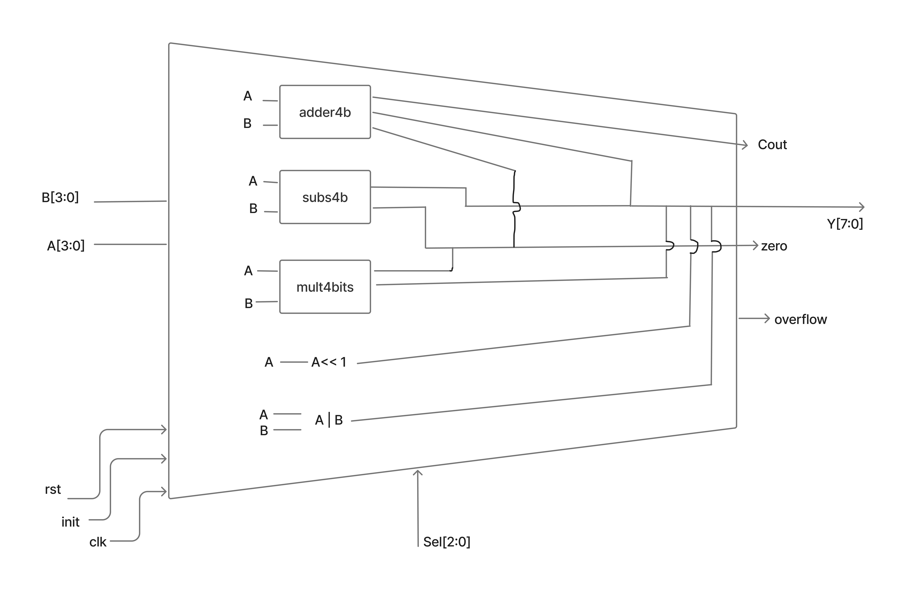

# Lab02 - Unidad Aritmético-Lógica (ALU)

## Integrantes
* [Brandon Alexis Galeano Martínez](https://github.com/BAgaleanoM)
* [Juan David Torres Román](https://github.com/JuandavidT02)

---

## Índice
1. [Descripción General](#descripción-general)
2. [Operaciones de la ALU](#operaciones-de-la-alu)
3. [Estructura del Proyecto](#estructura-del-proyecto)
4. [Simulaciones](#simulaciones)
5. [Implementación en FPGA](#implementación-en-fpga)
6. [Conclusiones](#conclusiones)
7. [Referencias](#referencias)

---

## Descripción General

En este laboratorio se diseñó una **Unidad Aritmético-Lógica (ALU)** de 4 bits utilizando el lenguaje **Verilog**.  
El objetivo fue implementar un módulo capaz de realizar operaciones aritméticas y lógicas básicas, controladas mediante una señal de selección (`sel`).  

El proyecto incluyó:
- Implementación modular de las operaciones suma, resta y multiplicación; la operación OR y el corrimiento se desarrollaron en el mismo mux.
- Creación de un multiplexor para seleccionar la salida correspondiente.
- Testbench con **GTKWave**.
- Pruebas físicas en una **FPGA Zybo Z7**.

---

## Operaciones de la ALU

La ALU ejecuta **cinco operaciones** sobre dos operandos de 4 bits (`A` y `B`).  
La suma, resta y multiplicación están diseñadas como operaciones implementadas en un bloque independiente, mientras que OR y el corrimiento están implementadas en el mismo mux y en este caso en el case respectivo, para acceder a case se utiliza y se controla mediante la señal `sel`.

| Código `sel` | Operación | Descripción |
|---------------|------------|--------------|
| `000` | Suma | `Y = A + B` |
| `001` | Resta | `Y = A - B`  |
| `010` | Multiplicación | `Y = A * B` |
| `011` | OR Lógica | `Y = A OR B` |
| `100` | Corrimiento Izquierda | `Y = A << 1` |

### Suma
Parte de un sumador de 1 bit realizado a partir de compuertas lógicas, luego de esto, se conectan en serie 3 sumadores más para realizar el sumador de 4 bits.  
En este caso no es posible una salida **overflow**, ya que el resultado siempre será máximo de 5 bits, todos estos se disponen en Y que es de 8 bits.
De igual forma se dispone de la bandera zero cuando el resultado sea cero.

### Resta
Implementada mediante el **complemento a dos** del operando `B`, se emplea la misma lógica que en el sumador completo pero en este caso com se menciona, utilizando un complemento a dos, se reutiliza el mismo bloque del sumador.
De igual forma se dispone de la bandera zero cuando el resultado sea cero, cuando `A` y `B` sean iguales.
El resultado overflow no es posible ya que la salida tiene 8 bits disponibles.

### Multiplicación
Multiplica los operandos `A` y `B`, generando una salida de **8 bits**; la multiplicación se realiza empleando la máquina de estados realizada en el `Laboratorio 1`, en este caso no se puede obtener un overflow ya que obtendremos una salida como máximo de 8 bits, pero si se puede obtener un resultado cero cuando uno de sus multiplicadores ya sea `A` o `B` sea cero.

### OR Lógica
Opera bit a bit la compuerta lógica OR entre `A` y `B`.  
Permite verificar el comportamiento combinacional puro de la ALU.

### Corrimiento Izquierda
Desplaza todos los bits de `A` una posición a la izquierda, lo cual da como resultado el equivalente a una multiplicación por 2, de esta manera obtenemos que la salida siempre tendrá un bit más que el valor inicial.
Permite observar el efecto sobre los bits más significativos.

### Diagrama de la ALU
En el siguiente diagrama se presenta un esquema de la ALU, donde los módulos encargados de la multipliación, suma y resta son instanciados por el multiplexor. El corrimiento y la compuerta OR son hechos por métodos que verilog permite, esto se puede evidenciar en el código de la ALU, donde la sección del selector implementa directamente estas dos operaciones, sin instanciar módulos extra.

---

## Estructura del Proyecto

El repositorio contiene los siguientes archivos en la carpeta scr:

| Archivo | Descripción |
|----------|-------------|
| **`adder.v`** | Módulo donde se emplea la lógica combinacional de un sumador de un bit. |
| **`adder4b.v`** | Implementación del sumador completo de 4 bits. |
| **`subs4b.v`** | Módulo de resta usando complemento a dos. |
| **`mult4bits.v`** | Módulo de multiplicación de 4 bits con salida de 8 bits. |
| **`alu4b.v`** | Módulo principal donde se tiene el Multiplexor de 3 entradas que selecciona la operación según `sel`, se recibe en este caso `A`,`B` y `sel`. |

Los módulos de suma, resta y multiplicación fueron diseñados a medida que se iban necesitando en la asignatura para actividades anteriores, es por esto que suma y resta emplean compuertas lógicas mientras que multiplicación emplea una máquina de estados, la compuerta OR y el corrimiento se diseñaron una manera diferente ya que fueron nuevas operaciones para este laboratorio y se tienen nuevos conocimiento que permiten facilitar su integración, simulación y depuración.

---

## Simulaciones

Se elaboró un **testbench (`alu4b_tb.v`)**, que prueba todas las operaciones de la ALU secuencialmente.  
Durante la simulación se variaron `A`, `B` y `sel`, observando la salida `Y` y las señales de control.

**Herramientas utilizadas:**
- **GTKWave** → Simulación y visualización de formas de onda.
- **Vivado** → Síntesis, implementación, generación del bitstream y programación de la FPGA.

### Resultados de simulación
- Los resultados de cada operación coincidieron con los valores teóricos esperados.
- El **multiplexor** cambió correctamente la salida en función de `sel`.
- No se observaron retardos significativos ni errores de propagación.
- En las operaciones aritméticas, se comprobó el manejo adecuado del overflow.

**Ejemplo de prueba:**
| A | B | sel | Operación | Resultado esperado |
|---|---|-----|------------|--------------------|
| 3 | 5 | 000 | Suma | 8 (1000) |
| 9 | 2 | 001 | Resta | 7 (0111) |
| 4 | 3 | 010 | Multiplicación | 12 (00001100) |
| 6 | 3 | 011 | OR | 7 (0111) |
| 5 | X | 100 | Corrimiento izquierda | 16 (1000) |

Las formas de onda en **GTKWave** muestran claramente los cambios de salida y el efecto del selector `sel` en tiempo real.

---

## Implementación en FPGA

En la implementación práctica, se usaron **DIP Switches** y **LEDs** tanto de la placa FPGA como unos físicos que se establecieron en una protoboard para representar las entradas y salidas.

| Señal | Descripción | Elemento físico |
|-------|--------------|----------------|
| `A[3:0]` | Entradas del operando A | DIP Switch (SW0–SW3), en la protoboard |
| `B[3:0]` | Entradas del operando B | DIP Switch (SW4–SW7), en la protoboard |
| `sel[2:0]` | Selector de operación | DIP Switch (SW8–SW10), en la FPGA |
| `Y[7:0]` | Salida de la ALU | LEDs (LD0–LD7), en la protoboard |

Cabe recalcar que para la utilización de los **DIP Switches** en la protoboard estos se configuraron en el `.xdc` como pulldown para cersiorarnos de su valor lógico y para no emplear resistencias. 

**Configuración:**
- Se utilizó **Vivado Design Suite** para síntesis, implementación y generación del bitstream.  
- Se asignaron los pines mediante el archivo `.xdc` de la FPGA Zybo Z7, descargado de la página oficial de xilinx.  
- El sistema se probó con valores representativos para validar todas las operaciones.

**Observaciones:**
- Las salidas respondieron de forma correcta a los cambios en los switches.  
- No se presentaron errores de conexión ni conflictos de pines, gracias a las buenas prácticas empleadas durante el desarrollo del laboratorio.  
- La multiplicación mostró correctamente los 8 bits de salida en los LEDs.

---

## Conclusiones

- Se implementó correctamente una **ALU modular de 4 bits**, capaz de realizar cinco operaciones aritmético-lógicas básicas.  
- El uso de **módulos jerárquicos** facilitó el diseño, depuración y simulación del sistema.  
- Las **simulaciones** en GTKWave confirmaron la correcta selección de operaciones y el buen funcionamiento del multiplexor.  
- La **implementación en FPGA** permitió validar el diseño en hardware, comprobando la relación entre el modelo digital y el comportamiento físico.  
- Este laboratorio permitió afianzar conceptos de **arquitectura digital, diseño combinacional, reutilización de módulos y verificación por simulación**.

---

## Referencias

- M. Morris Mano, *Diseño Digital: Principios y Prácticas*, 4ta edición, Pearson, 2011.  
- Xilinx Inc., *Vivado Design Suite User Guide*, UG973, 2022.  
- HDLBits, *Arithmetic Logic Unit Exercises*, [https://hdlbits.01xz.net](https://hdlbits.01xz.net)  
- Pineda Vargas, E. F., *Material de clase: Electrónica Digital II – Universidad Nacional de Colombia*, 2025.  
- Patterson, D. & Hennessy, J., *Computer Organization and Design: The Hardware/Software Interface*, Morgan Kaufmann, 2017.
